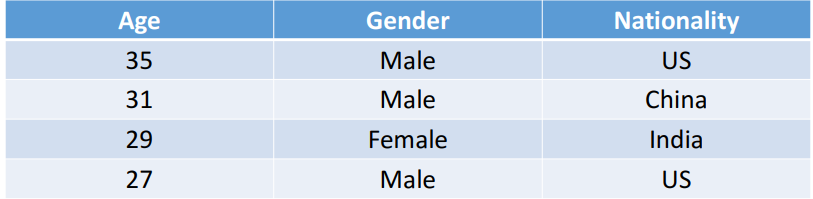
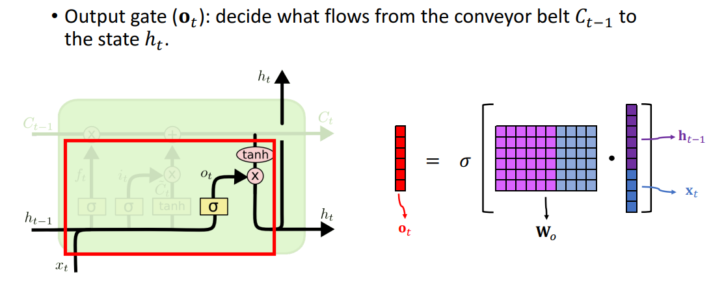

# NLP+IMAGE项目尝试

## 项目背景

结合文本和图像进行模型训练，是模型能结合文本和图像信息进行诊断预测。最终效果，输入两张X光图像，模型可以根据图像生成诊断报告。

## NLP基础知识

## 1、NLP中数据处理方式

### 1.1 数据表示方式

在文本信息处理中两大类常见的数据形式，一种是数字特征(Numeric Features)的文本，另一种是类别特征(Categorical Features)的文本。

- Age: Numeric Feature
  - 对于NF类特征，数值本身既可以作为对应的值
- Gender、Nationality: Categorical Feature
  - Gender: 可以用一个bool变量来代表。Female->0  Male->1
  - Nationality: 建立一个字典来对应国家
    - E.g.   US->1,		China->2,		India->3,		Japan->4,		Germany->5
    - 注意：从1开始，0用于标记数据缺失或异常

### 1.2 One Hot Encoded

对于Categorical Feature而言，我们需要把文字映射为数字信息计算机才能处理，但是这些单个数字的信息并不能很好的从语义上解释Categorical Feature。

例如：US->1、China->2

- 在网络进行操作的时候，我们通常需要数据进行求和等操作，那么CF特征进行求和 “US”+ “China” = 3 = “India”，那么显然是不合理的

- 所以我么要对CF特征进行One Hot编码

  - US: [1, 0, 0, 0, ⋯ , 0 ]
  -  China: [0, 1, 0, 0, ⋯ , 0] 
  - India: [0, 0, 1, 0, ⋯ , 0]

   这样： “US”+ “China” = [1, 1, 0, 0, ⋯ , 0]，可以理解为即由美国国籍，又有中国国际。虽然我们国家不承认双重国际，但是这样表示CF特征是可以理解且进行解释的。

  

### 1.3 文本处理

#### 1.3.1 Tokenization (Text to Words)

Tokenization就是将一个句子文本，变成一个个单词组成的列表，或者是一个个字符组成的列表。

- We are given a piece of text (string), 
  - e.g., S = “… to be or not to be…”
- Break the string (string) into a list of words: 
  - L = […, to, be, or, not, to, be, …]

#### 1.3.2 Count Word Frequencies

对于一个全部都是单词组成的列表而言，我们需要把它转换为一个字典，然后可以用每个单词的频率来代表键值对的value

- 一篇文章的最后会转化为一个没有重复单词的字典，且字典中元素排列按照词频进行排序，一般从大到小进行排序

  

  

  - 将词频替换为index，此时每一个index其实就是代表了一个单词

    

    > 在将文本转化为上述Key-Value的字典的时候，可能会出现字典过大的情况，例如字典大到超过10k。那么其实全部存储是不利于进行处理的，需要去掉不常用的词，并且去除不常用的词是不会影响到语义的分析的。
    >
    > - 例如不常用的词可能是人名、地名等
    > - 过大的vocabulary字典会导致很高维度的one-hot-vector，这样计算会很慢，且难以拟合

#### 1.3.3 文本处理总结

- Input “… to be or not to be…”
- Then L = […, to, be, or, not, to, be, …]
- Next Indices Sequence: [2, 4, 8, 1, 2, 4]

完整文本处理示例，以一个IMDB评分数据集为例。

> Download from：
>
> - http://ai.stanford.edu/~amaas/data/sentiment/ 
> - http://s3.amazonaws.com/text-datasets/aclImdb.zip
>
> 50K movie reviews (text)，25K for training and 25K for test

**step 1 : Tokenization and Change to Indices Sequences**

**Step2: Align Sequences**

> - Solution:
>   - Cut off the text to keep w words, eg. w=7
>   - If the text is shorter than w, pad it with zeros.
>
> 

【注意】

- 测试集中的字典要用训练集中建立的，不然会造成index有歧义

### 1.4 Word Embedding: Word to Vector

#### 1.4.1 One-Hot Encoding

#### 1.4.2 Word Embedding

此时得到的One-Hot向量为度有V维，非常得高，需要进行降维

我们现在得One-hot vector是 $v$ 维得，但是 $v$ 太大了，需要进行降维。降维得经典想法就是特征值分解，简单得来说可以用一个 $d\times v$得矩阵来对 $v\times1$ 的vector进行降维，其中 $d \leq v$

- 矩阵P是模型需要学习的特征提取矩阵$p\in \real^{v\times d}$

- 可以对矩阵P进行如下解释

  假设我们要把维度压缩成2维，即$d=2$， 那么可以将如下矩阵进行可视化

  

  其中矩阵的每一行代表每个词，两个特征可以在笛卡尔坐标系用坐标表示，那么可以发现，此行相同的词语在二维平面中是相近的。

## 2、常见的时序模型

卷积网络的局限性：

- 需要一次输入完整的数据，但是在NLP处理中，每次输入完整的一句话是不符合语言处理逻辑的
- 卷积网络的输入是固定的，但是文本有长有短，要求所有输入固定也是不现实的
- 输出固定，再翻译问题的过程中，输出结果长度就不一致

#### 2.1 RNN网络

下图是RNN的结构图，从下往上观察。

- 单词首先通过Word embedding变成词向量 $x_i$
- 然后词向量 $x_i$再结合上一状态输出 $h_{t-1}$，共享矩阵A计算得到当前时刻状态 $h_0$
- 状态沿着词语先后顺序的时序训练向后传递，一直到计算处最后一个状态 $h_t$

对于每一个单元中具体的运算如下图：

- 输入为上一时刻得到的结果 $h_{t-1}$和当前的词向量 $x_t$ 将连个向量concate到一起

- 然后与共享矩阵 $A$ 进行相乘

- 之后再输入激活函数 $tanh$，得到当前时刻的输出结果 $h_t$

  > tanh是为了防止梯度爆炸或消失：
  >
  > 
  >
  > - 假设词向量$x_0=x_1=....x_{100}=0$
  > - 那么$h_{100} = Ah_{99}=A^2h_{98}=...=A^{100}h_0$
  >   - 如果当$\lambda_{max}(A)<1$ , 就会产生数值消失，$h_{100}$非常的小
  >   - 如果当$\lambda_{max}(A)>1$ , 就会产生数值爆炸，$h_{100}$非常的大

##### 2.1.1 RNN总结

- simple rnn只适用于短期记忆，对于长期记忆而言，由于梯度传递过长，所以较远的知识会被遗忘

- RNN中的parameter matrix的大小为 $shape(h) \times [shape(h)+shape(x)]$ , 注意参数矩阵是共享的，不管序列多长都只有一个参数矩阵

- 如果用于分类的话，就可以直接将最后结果 $h_t$ 结合sigmod 加上交叉熵损失即可梯度下降进行训练

  

#### 2.2 LSTM网络

凡是可以用Simple RNN的都可以替换成LSTM，且效果一定会比RNN好

LSTM与RNN的不同点就是A模块内的计算不同，他增加了许多的结构

##### **传送门Converyor Belt:** 

直接将数据传输到下一状态，通过传输带来避免梯度小时的问题

##### **遗忘门 Foget Gate :** 

遗忘门的主要体现是体现在参数 $f_t$ 上， 参数 $f_t$ 始输入经过$sigmod$函数$\sigma$的结果，假定输入用$a$表示，那么模型可以简化如下：

经过 $\sigma$ 函数之后，向量 $a$ 会被放缩到0-1之间，此时 f 再点乘 $c$ ，那么  $f$ 中对应为0的值会将 $c$ 中对应的值变为0，这就起到了遗忘的作用

-  向量$a$实际上是由上一输入 $h_{t-1}、x_t$计算而得，计算方式如下：
  $$
  f_t = sigmod(w_f \cdot [h_{t-1}, x_t]^t)
  $$
  $x_t$为Embedding的词向量，$h_{t-1}$为上一时刻的输出 ， $w_f$为需要学习的权重向量

##### 输入门 Input Gate

- 输入门 $i_t$ 的计算如下：

$$
i_t = sigmod(w_i \cdot [h_{t-1},x_t]^T)
$$

- 计算 new value $\hat C_t$：

  
  $$
  \hat C_t = tanh(w_c\cdot[h_{t-1}, x_t]^t)
  $$

##### 更新Converyor Belt

传送带上的值等于遗忘门点乘上一时刻状态，再加上new value点乘输入们
$$
C_t = f_t\cdot C_{t-1} + i_t \cdot \hat C_{t}
$$

##### 输出门 Output Gate

输出门 $O_t$:
$$
O_t = sigmod(W_o \cdot [h_{t-1}, X_t]^t)
$$

##### 总结

- LSTM参数两是SimpleRNN的4倍，由4个参数矩阵需要训练
- LSTM能很好的克服RNN短期记忆的缺陷
- 理论上，能用RNN的地方都可以改进为LSTM且效果都会比RNN好

## 1. 数据处理部分

## 2.搭建DataLoader

## 3. 模型搭建及训练

